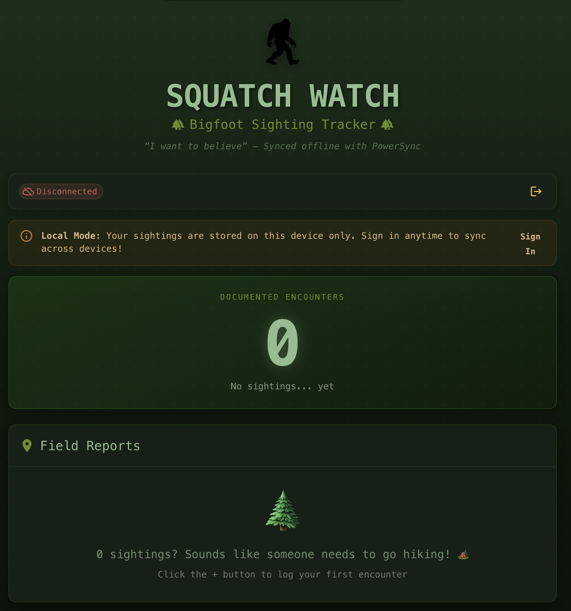

# Next.js + Capacitor + PowerSync Demo

A demo application showcasing [PowerSync](https://www.powersync.com/) with [Next.js](https://nextjs.org/) and [Capacitor](https://capacitorjs.com/) for building mobile and web apps with [Supabase](https://supabase.com/) as the backend.

## Features

- 📱 **Cross-platform** - Runs on Web, iOS, and Android via Capacitor
- 🔐 **Flexible Auth** - Email/password, anonymous sign-in, or local-only mode
- 🎨 **Forest Theme** - Beautiful dark forest theme for tracking cryptid sightings
- 📝 **Bigfoot Tracker** - "Squatch Watch" app for recording Bigfoot sightings
- 🔄 **Offline-First** - Works offline with PowerSync, syncs when connected
- 🦶 **Easter Eggs** - Find the hiding Bigfoot!

## Demo

<table>
  <tr>
    <td></td>
    <td></td>
  </tr>
  <tr>
    <td align="center"><em>Sign In - Multiple auth options</em></td>
    <td align="center"><em>Sightings - Track Bigfoot encounters</em></td>
  </tr>
</table>

## Tech Stack

- **Frontend**: Next.js (Pages Router), React, TypeScript
- **UI**: Material UI, Formik
- **Database**: PowerSync (local SQLite) + Supabase (PostgreSQL)
- **Mobile**: Capacitor (iOS/Android)
- **Auth**: Supabase Anonymous Sign-in

## Quick Start: Local Development

This demo can be started with local PowerSync and Supabase services.

### Prerequisites

- [Node.js](https://nodejs.org/) (v22+)
- [Docker](https://www.docker.com/)
- [Supabase CLI](https://supabase.com/docs/guides/cli/getting-started)

### 1. Install Dependencies

```bash
npm install
```

### 2. Copy Environment Variables

The default values will work with a local development configuration. These can be edited later for a cloud configuration.

```bash
cp .env-template .env.local
```

### 3. Start Supabase

Follow the [Supabase CLI instructions](https://supabase.com/docs/guides/cli/getting-started) for initial setup, then:

```bash
cd local-dev/supabase
supabase start
```

This will automatically run the migrations in `local-dev/supabase/migrations/` to create the `sightings` table.

### 4. Start PowerSync Service

In the repo root directory, run:

```bash
docker run --rm \
  -p 8080:8080 \
  -e POWERSYNC_CONFIG_B64=$(base64 -i ./local-dev/powersync/config.yaml) \
  -e POWERSYNC_SYNC_RULES_B64=$(base64 -i ./local-dev/powersync/sync-rules.yaml) \
  --network supabase_network_next-capacitor-demo \
  --name powersync-next-capacitor \
  journeyapps/powersync-service:latest
```

### 6. Start the Development Server

```bash
npm run dev
```

Open [http://localhost:3000](http://localhost:3000) to see the app.

## Building for Production

### Web

```bash
npm run build
```

Static files will be generated in the `out/` directory.

### iOS

```bash
npm run run:ios
```

### Android

```bash
npm run run:android
```

## Environment Variables

| Variable                        | Description            |
| ------------------------------- | ---------------------- |
| `NEXT_PUBLIC_SUPABASE_URL`      | Supabase project URL   |
| `NEXT_PUBLIC_SUPABASE_ANON_KEY` | Supabase anonymous key |
| `NEXT_PUBLIC_POWERSYNC_URL`     | PowerSync service URL  |

## Learn More

- [PowerSync Documentation](https://docs.powersync.com/)
- [Supabase Documentation](https://supabase.com/docs)
- [Next.js Documentation](https://nextjs.org/docs)
- [Capacitor Documentation](https://capacitorjs.com/docs)
